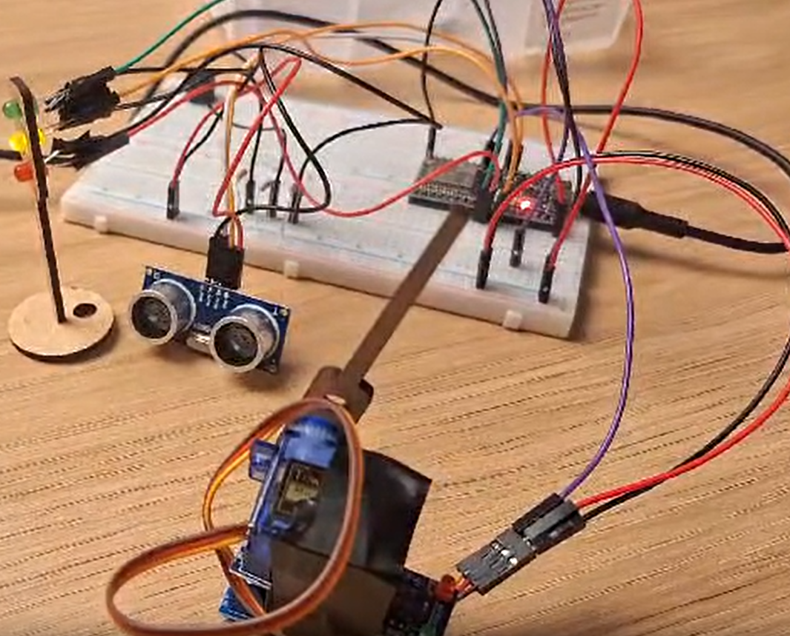
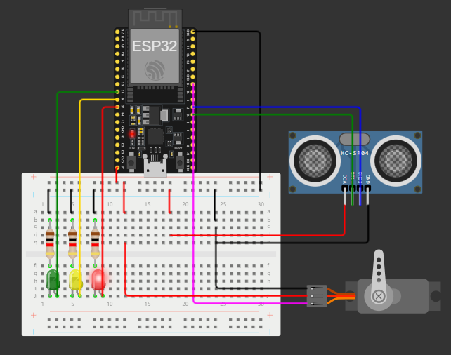

# Ponderada Semáforos - Semana 2
## Turma 11 - grupo 4
#### Nome: Ian Pereira Simão

## Sumário

[1.1. A atividade](#1-circuito)

[1.2. circuito](#11-desenvolvimento-e-resultado)

[1.3. Avaliação em Pares](#13-avaliação-em-pares)

[2. Referências](#2-referências)

 

## 1. Circuito
&nbsp;&nbsp;&nbsp; O circuito do semáforo foi montado em uma protoboard com LEDs nas cores vermelho, amarelo e verde e resistores de 1K para limitar a corrente, garantindo que os componentes não sejam queimados devido à uma tensão alta. O sistema também conta com um sensor de distância ultrassônico, que detecta a aproximação de pedestres, e um servo motor que funciona como uma "cancela" física. Este servo impede a passagem quando o sinal não está verde, o que é o diferencial do sistema, e oferece segurança para os pedestres.

&nbsp;&nbsp;&nbsp; A ligação dos componentes foi realizada de modo a utilizar uma fonte de energia comum do microcontrolador ESP32, enquanto o código foi programado para controlar os tempos e reações do sistema conforme a detecção de aproximação dos pedestres. Abaixo estão os componentes e suas conexões principais:

   Figura 1 - Protótipo físico

    

   Fonte: Material produzido pelo autor (2024)

   Figura 2 - Diagrama feito no wokwi do projeto semáforo 

    

   Fonte: Material produzido pelo autor (2024)

- **LEDs**: conectados a portas digitais e configurados como saídas para simular o semáforo.
- **Resistores**: conectados em série com cada LED para limitar a corrente e evitar danos.
- **Sensor Ultrassônico**: posicionado para detectar a aproximação de pedestres a uma distância específica (10 cm).
- **Servo Motor**: configurado para atuar como cancela e posicionado fisicamente para obstruir a passagem quando o sinal está vermelho.

## 1.1. Desenvolvimento e Resultado

&nbsp;&nbsp;&nbsp; O desenvolvimento começou com a montagem do circuito e a configuração do código, seguindo os requisitos de tempo para cada cor do semáforo. O código foi escrito para controlar o ciclo do semáforo, garantindo a segurança dos pedestres com o uso de uma cancela física, que bloqueia a passagem quando o sinal está vermelho ou amarelo. 

&nbsp;&nbsp;&nbsp; Após a montagem, o código foi implementado e ajustado conforme necessário. Para o funcionamento do sensor de distância, foram feitos testes para garantir que ele detectasse corretamente a presença de um pedestre e liberasse a passagem apenas quando a distância estivesse abaixo de 10 cm e o sinal estivesse verde. Caso contrário, o semáforo mantinha-se vermelho, mesmo que o ciclo normal tivesse mudado, até que um pedestre se aproximasse.

https://github.com/user-attachments/assets/634c6fc9-1626-4a6c-8872-283555c46da9

### Resultados Observados
- **Funcionamento adequado**: o semáforo segue o ciclo definido (6 segundos vermelho, 2 amarelo, 4 verde, 2 amarelo).
- **Detecção de pedestres**: o sensor ultrassônico detecta corretamente pedestres a uma distância de 10 cm, permitindo a liberação da cancela.
- **Controle da cancela**: o servo motor bloqueia e libera a passagem conforme o estado do semáforo e a presença de um pedestre.

## 1.3. Avaliação em pares

### Avaliador: Nicolas Ramon

| Critério                                                                                                 | Contempla (Pontos) | Contempla Parcialmente (Pontos) | Não Contempla (Pontos) | Observações do Avaliador |
|---------------------------------------------------------------------------------------------------------|--------------------|----------------------------------|--------------------------|---------------------------|
| Montagem física com cores corretas, boa disposição dos fios e uso adequado de resistores                | Até 3              | Até 1,5                          | 0                        | A montagem possui boa disposição dos fios e os resistores foram utilizados corretamente para limitar a corrente dos LEDs. |
| Temporização adequada conforme tempos medidos com auxílio de algum instrumento externo                  | Até 3              | Até 1,5                          | 0                        | A temporização segue o ciclo estipulado para cada cor (6s vermelho, 2s amarelo, 4s verde, 2s amarelo), permitindo uma sequência coerente. |
| Código implementa corretamente as fases do semáforo e estrutura do código (variáveis representativas e comentários) | Até 3              | Até 1,5                          | 0                        | O código foi estruturado corretamente para implementar as fases do semáforo e está bem comentado para facilitar o entendimento. |
| Extra: Implementou um componente de liga/desliga no semáforo e/ou usou ponteiros no código              | Até 1              | Até 0,5                          | 0                        | Não há ponteiros no código, mas a cancela que abre e fecha baseada na distância adquirida pelo sonar ficou bem feita. |
|                                                                                                         |                    |                                  |                          | **Pontuação Total: 10** |

### Avaliador: Kauã Rodrigues

| Critério                                                                                                 | Contempla (Pontos) | Contempla Parcialmente (Pontos) | Não Contempla (Pontos) | Observações do Avaliador |
|---------------------------------------------------------------------------------------------------------|--------------------|----------------------------------|--------------------------|---------------------------|
| Montagem física com cores corretas, boa disposição dos fios e uso adequado de resistores                | Até 3              | Até 1,5                            | 0                        |                           |
| Temporização adequada conforme tempos medidos com auxílio de algum instrumento externo                  | Até 3              | Até 1,5                          | 0                        |                           |
| Código implementa corretamente as fases do semáforo e estrutura do código (variáveis representativas e comentários) | Até 3              | Até 1,5                          | 0                        |                           |
| Extra: Implmeentou um componente de liga/desliga no semáforo e/ou usou ponteiros no código | Até 1              |  Até 0,5                         | 0                        |                           |
|  |                                                             |  | |Pontuação Total|

## 2. Referências
Espressif Systems. ESP32 Series Datasheet. Disponível em: https://www.espressif.com/sites/default/files/documentation/esp32_datasheet_en.pdf. Acesso em: 31 out. 2024.

Arduino. ESP32Servo Library Documentation. Disponível em: https://github.com/madhephaestus/ESP32Servo. Acesso em: 31 out. 2024.

CHATGPT. Disponível em: https://chatgpt.com/
